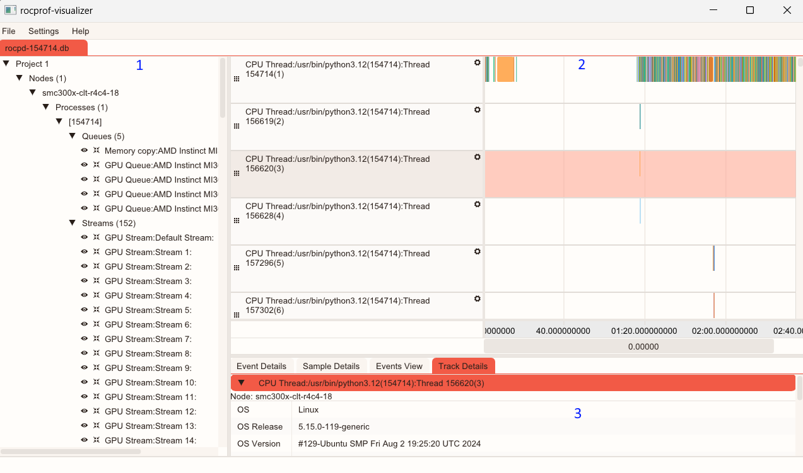

# rocprofiler-visualizer
A visualizer for the ROCm Profiler Tools. 

## Install
Currently the application is deployed as a single executable.  No installation necessary.

## Usage Instructions

### Open a Trace
Use the `File` -> `Open` menu to open a trace file.

Supported formats are *.db* and *.rpd* trace files.

### UI Layout

1. System Topology Tree: Expand tree nodes to see relationship between tracks.
2. Timeline View: List of tracks containing event or sample counter data.
3. Advanced Details Area: Shows detailed information about selected events and tracks. 

### Controls / Interactions
1. System Topology Tree
    - Click to expand / collapse the tree nodes.
    - Click on the track node to select it.
    - Click the eye icon to show or hide the track
    - Click the `Scroll To Track` button to navigate to this track in the Timeline View.

2. Timeline View
    - The timeline view has two areas, the grey *Description* area and white *Graph* area where events and counter graphs are plotted.
    - Pan and scroll the timeline view using the scrollbars.
    - Dragging the mouse on the *Graph* area of the track will also scroll and pan the view.
    - When hovering over the *Graph* area the scroll wheel will zoom the view.
    - When hovering over the *Description* area of the track the scroll wheel will scroll the track list.
    - Display options for each track can be accessed by clicking the gear icon in track's *Description* area.
    - Clicking the *Description* area will select or deselect the track.  When selected, the track details will be displayed in the *Event Details* or *Sample Details* tabs in the *Advanced Details Area", depending on the track type.
    - Clicking on an *Event* in the *Graph* area will select or deselect an event. When selected details for the event can be seen in the *Events View* tab of the *Advanced Details Area*.
    - Double clicking on the *Graph* will start a *Time Range Filter* selection.  Double click again to finish the selection.  Double click again to clear the selection.
    - Tracks can be resized by hovering over and dragging the separator lines between tracks.
    - Tracks can be reordered by clicking and dragging the grip on left side of the *Description* area.
    - When there is an active *Time Range Filter* the trace can be trimmed using the `File->Save Selection` menu option.  This will create a new trace file containing only the events in the selection zone.

3. Advanced Details Area
    - Use the tabs to see different detailed information events and tracks
    - The *Event Details* and *Sample Details* tabs provide a list (table) of the events or samples contained the selected track or tracks. 
    - In the *Event Details* tab there is a drop down box that allows the events grouped by a column to display additional metrics
    - Both the *Event Details* and *Sample Details* provide a text input box that can be used to filter the data.  Ex: `min_duration > 2000` will filter all events shorter than 2000 ns.
    - Setting a *Time Range Filter* using the timeline view will filter the rows displayed in the table to be contained within the selected time range.
    - The *Events View* tab shows detailed information about currently selected event in the timeline view.
    - The *Track Details* tab shows additional information about the currently selected tracks.
