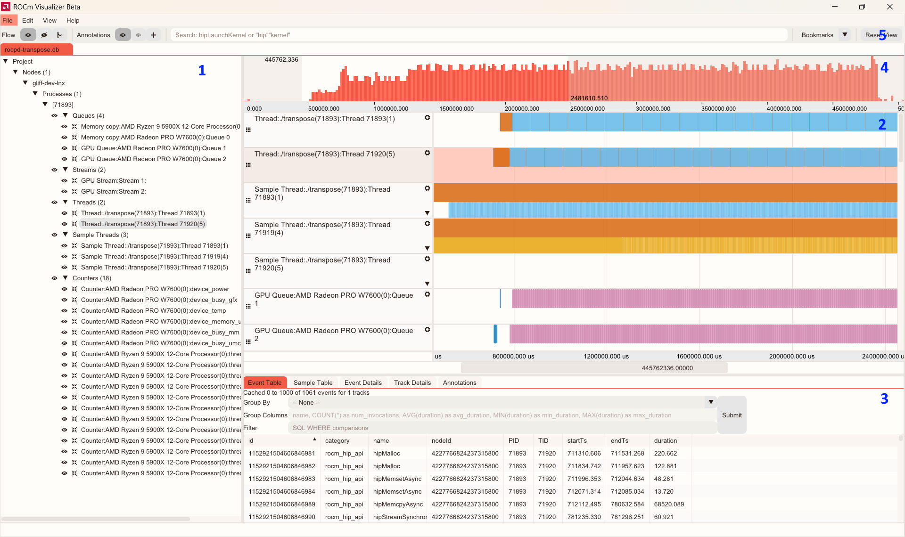

> [!NOTE]
> The published ROCm™ Optiq documentation is available [here](https://rocm.docs.amd.com/projects/roc-optiq/en/latest/) in an organized, easy-to-read format, with search and a table of contents. The documentation source files reside in the `docs` folder of this repository. As with all ROCm projects, the documentation is open source. For more information on contributing to the documentation, see [Contribute to ROCm documentation](https://rocm.docs.amd.com/en/latest/contribute/contributing.html).

# rocprofiler-visualizer
A visualizer for the ROCm Profiler Tools. 

## Install
Currently the application is deployed as a single executable.  No installation is necessary.

## Usage Instructions

### Open a Trace
Use the `File` -> `Open` menu to open a trace or project file.

Supported trace formats are *.db* and *.rpd* trace files. Project files have the extension *.rpv*.

Files can also be opened by dragging and dropping them onto the application window.

### Projects
Customizations made to tracks, bookmarks, and annotations can be persisted by saving the session as a project. Upon opening a project file, the associated trace file and previous customizations will be recalled.

Use `File` -> `Save As` to create a new project, use `File` -> `Save` to overwrite the currently opened project.

### UI Layout

1. System Topology Tree: Expand tree nodes to see relationship between tracks.
2. Timeline View: List of tracks containing event or sample counter data.
3. Advanced Details Area: Shows detailed information about selected events and tracks. 
4. Histogram Area: Shows an event density map.
5. Toolbar: Provides controls for various functions.

### Controls / Interactions
1. System Topology Tree
    - Click to expand / collapse the tree nodes.
    - Click on the track node to select it.
    - Click the eye icon to show or hide the track
    - Click the `Scroll To Track` button to navigate to this track in the Timeline View.

2. Timeline View
    - The timeline view has two areas, the grey *Description* area and white *Graph* area where events and counter graphs are plotted.
    - Pan and scroll the timeline view using the scrollbars.
    - Dragging the mouse on the *Graph* area of the track will also scroll and pan the view.
    - When hovering over the *Graph* area the scroll wheel will zoom the view.
    - The WASD and arrow keys can be used to zoom and pan the view as well:
        - W / S: Zoom in and out respectively.
        - A or Left Arrow / D or Right Arrow: Pan left and right respectively.
        - Up Arrow / Down Arrow: Scroll track list up and down.
    - When hovering over the *Description* area of the track the scroll wheel will scroll the track list.
    - Display options for each track can be accessed by clicking the gear icon in track's *Description* area.
    - Clicking the *Description* area will select or deselect the track.  When selected, the track details will be displayed in the *Track Details* pane. Additionally, depending on the track type, the *Event Table* or *Sample Table* tabs in the *Advanced Details Area" will be populated by the contents of the track. 
    - Clicking on an *Event* in the *Graph* area will select or deselect an event. When selected, details for the event can be seen in the *Event Details* tab of the *Advanced Details Area*.
    - Double clicking on the *Graph* will start a *Time Range Filter* selection.  Double click again to finish the selection.  Double click again to clear the selection.
    - Tracks can be resized by hovering over and dragging the separator lines between tracks.
    - Tracks can be reordered by clicking and dragging the grip on left side of the *Description* area.
    - When there is an active *Time Range Filter* the trace can be trimmed using the `Edit->Save Trace Selection` menu option.  This will create a new trace file containing only the events in the selection zone.
    - The current view (scroll and zoom position) can be saved to a bookmark for quick navigation.  Use `ctrl` + keys `0`- `9` to create a view bookmark and keys `0` - `9` to restore the view to a stored bookmark. 
    - Bookmarks can also be set and recalled using the Bookmark dropdown on the main toolbar.
    - Annotations can be managed (add/show/hide) from the main toolbar Annotations panel.

3. Advanced Details Area
    - Use the tabs to see different detailed information events and tracks
    - The *Event Details* and *Sample Details* tabs provide a list (table) of the events or samples contained in the selected track or tracks.
    - Right click on the column headers to show / hide columns.
    - In the *Event Table* tab there is a drop-down box that allows the events grouped by a column to display aggregated metrics.
    - Both the *Event Table* and *Sample Table* provide a text input box that can be used to filter the data.  Ex: `min_duration > 2000` will filter all events shorter than 2000 ns.
    - Right click on a table row and select `Go to event` to navigate the timeline view to the highlighted event.
    - Setting a *Time Range Filter* using the timeline view will filter the rows displayed in the table to be contained within the selected time range.
    - The *Event Details* tab shows detailed information about currently selected events in the timeline view.
    - The *Track Details* tab shows additional information about the currently selected tracks.
    - The *Annotations* tab shows a list of user created annotations.
        - Annotations can be individually hidden and shown using this interface.
        - Clicking on a row will bring the associated annotation into view.

4. Histogram Area
    - Displays an event density histogram map.
    - When timeline is zoomed the area currently in view is highlighted.
    - Viewable area can be dragged to scroll timeline view.

5. Toolbar
    - Provides controls for various application functions.
    - Buttons for showing and hiding flow information on timeline.
    - Selecting the flow rendering mode. (Fan or chain mode).
    - Buttons for showing, hiding and adding Annotations.
    - A search bar for finding events within the trace.
    - Controls for adding, removing, and navigating bookmarks.
    - A button to reset the timeline view to default zoom and pan.
