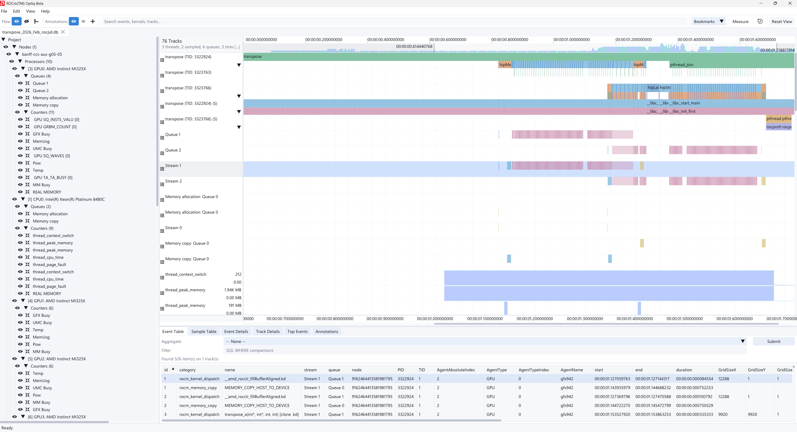
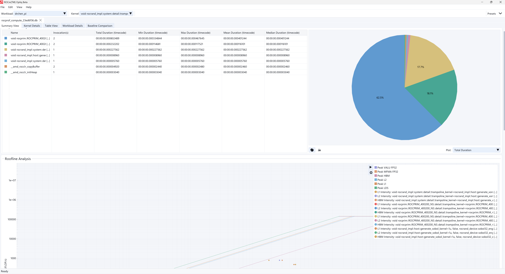

# ROCm Optiq: Visualization and Analysis for ROCm Profiler Data

[](https://github.com/ROCm/roc-optiq/actions/workflows/ci-controller.yml)

## Overview

ROCm Optiq (`roc-optiq`) is a unified visualization and analysis tool for performance data collected by the ROCm profiling tools,
specifically [ROCm Systems Profiler](https://rocm.docs.amd.com/projects/rocprofiler-systems/en/latest/index.html) and
[ROCm Compute Profiler](https://rocm.docs.amd.com/projects/rocprofiler-compute/en/latest/).
It brings system-level traces and kernel-level analysis data together in a single desktop application, so you can identify performance
bottlenecks, understand hardware utilization, and optimize workloads across CPUs and GPUs without switching between tools.

ROCm Optiq has no dependency on the ROCm stack itself. Collect data on a ROCm machine, then open it anywhere — Windows, Linux, or macOS.

> [!NOTE]
> The published ROCm Optiq documentation is available [here](https://rocm.docs.amd.com/projects/roc-optiq/en/latest/) in an organized, easy-to-read format, with search and a table of contents. The documentation source files reside in the `docs` folder of this repository. As with all ROCm projects, the documentation is open source. For more information on contributing to the documentation, see [Contribute to ROCm documentation](https://rocm.docs.amd.com/en/latest/contribute/contributing.html).

### Visualize ROCm Systems Profiler traces



Inspect CPU-GPU interactions, ROCm API calls, kernel execution timelines, memory usage, and system telemetry to find stalls,
memory bandwidth issues, and inefficient kernel launches.

- **System Topology** — explore the hardware (processors, queues, counters) and software (processes, streams, threads) hierarchies for
  navigating and correlating application execution with hardware resources.
- **Timeline** — view CPU and GPU activity, events, and performance counters in chronological order, with zoom, pan, filtering,
  measurement rulers, flow arrows, annotations, and bookmarks.
- **Advanced details** — inspect event and sample tables with grouping, expression filtering, and per-event, per-track, and top-event breakdowns.
- **Summary** — see the top kernels by execution time as a pie chart, bar chart, or table.
- **Minimap** — view a compact overview of event density and counter values across the whole trace to quickly navigate large datasets.

### Analyze ROCm Compute Profiler data



Explore kernel-level metrics for a profiled workload and locate bottlenecks quickly.

- **Summary** — a high-level overview of the selected workload, including duration and invocation statistics and a roofline chart.
- **Kernel details** — memory chart, System Speed-of-Light metrics, and roofline chart for the selected kernel, with a filterable kernel selection table for comparing across kernels.
- **Table view** — the complete list of available metrics for the selected kernel, grouped by category.
- **ISA View and PC sampling** — inspect a kernel's ISA, optionally correlate instructions with source lines, and show total, issue, and stall sample counts per instruction. The source pane reports the aggregated stall percentage for each top-level correlated source line. ISA, source, and sampling-state data load independently when needed.
- **Workload details** — system information and profiling configuration for the selected workload.
- **Baseline comparison** — a side-by-side view of two kernel measurements to assess regressions and improvements.

## Quick start

### System requirements

| Requirement | Details |
|-------------|---------|
| Operating system | Windows 11, Ubuntu 22.04 / 24.04, CentOS Stream 9, or macOS 14 / 15 |
| Memory | 16 GB RAM or more is recommended for large traces |
| ROCm (for data collection only) | ROCm 7.1.0 or later for ROCm Systems Profiler traces; ROCm 7.12.0 or later for ROCm Compute Profiler analysis data |

ROCm is not required on the machine running ROCm Optiq. To check the ROCm version on the machine where you collect data, run
`cat /opt/rocm/.info/version`.

### Install

Download the package for your platform from the [Releases](https://github.com/ROCm/roc-optiq/releases) page:

```shell
# Ubuntu (Debian-based)
sudo apt install ./roc-optiq-*.deb

# CentOS Stream / RHEL / Rocky
sudo dnf install ./roc-optiq-*.rpm
```

On Windows, run the installer and launch `roc-optiq.exe`. On macOS, unzip the archive and drag `roc-optiq.app` into `Applications`.

For detailed steps and verification commands, see the
[installation guide](https://rocm.docs.amd.com/projects/roc-optiq/en/latest/install/optiq-install.html).
To build from source instead, see [BUILDING.md](BUILDING.md).

### Open a trace

Use `File` > `Open`, drag a file onto the application window, or pass it on the command line:

```shell
roc-optiq -f /path/to/my_trace.db
```

Supported inputs are ROCm Systems Profiler traces (`.db`), RPD traces (`.rpd`), ROCm Compute Profiler analysis databases (`.db`), and ROCm
Optiq project files (`.rpv`). A project file stores your track customizations, bookmarks, and annotations alongside a reference to
the trace, and is created with `File` > `Save As`.

For the full list of command-line options, see the
[command-line reference](https://rocm.docs.amd.com/projects/roc-optiq/en/latest/reference/cli-support.html).

### Usage Instructions

Refer to ROCm documentation for detailed usage [instructions](https://rocm.docs.amd.com/projects/roc-optiq/en/latest/).

Walkthroughs for each area are in the how-to guides:
[view trace data](https://rocm.docs.amd.com/projects/roc-optiq/en/latest/how-to/view-trace.html),
[view analysis data](https://rocm.docs.amd.com/projects/roc-optiq/en/latest/how-to/view-analysis.html), and
[customize your project](https://rocm.docs.amd.com/projects/roc-optiq/en/latest/how-to/customize-views.html).

## Capturing traces or analysis data

When capturing System traces or Compute analysis data ensure that the rocpd or analysis db output formats are enabled.

### Systems Profiler

Set the `ROCPROFSYS_USE_ROCPD` environment variable to ensure rocpd output.

`ROCPROFSYS_USE_ROCPD=true rocprof-sys-run -- ./myapp`

### Compute Profiler

Enable .db analysis creation via the `--output-format db` parameter.

`rocprof-compute analyse --output-format db -p workloads/nbody/MI300X_A1`

### Rocprofv3

Enable rocpd output by using the `--output-format rocpd` parameter.

`rocprofv3 --output-format rocpd --hip-trace -- ./myapp`
 
`rocprofv3 --output-format rocpd --kernel-trace --hsa-trace -- ./myapp`

## Support

Report bugs and request features through the [GitHub issue tracker](https://github.com/ROCm/roc-optiq/issues).

## Contributions and license

Contributions of any kind are welcome. See [CONTRIBUTING.md](.github/CONTRIBUTING.md) for the contribution process and
[CODING.md](CODING.md) for the style rules that apply to all C++ changes.

Licensing information is in [LICENSE.md](LICENSE.md).
