.. meta::
  :description: Learn how to customize your ROCm Optiq project
  :keywords: Optiq, ROCm, customize, filter, bookmarks, annotations

.. _customize:

**********************************
Customize your ROCm™ Optiq project
**********************************

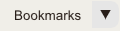

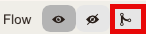

You can customize the data views of an opened trace file in ROCm Optiq such as display settings, saved trace selections, added bookmarks / annotations, and more.

.. _time-range-filter:

Set a time range filter
=======================

Set a time range filter in the :ref:`timeline` to limit that data displayed to a specific period. 

To set a time range filter, double-click a range in the **Timeline View**.

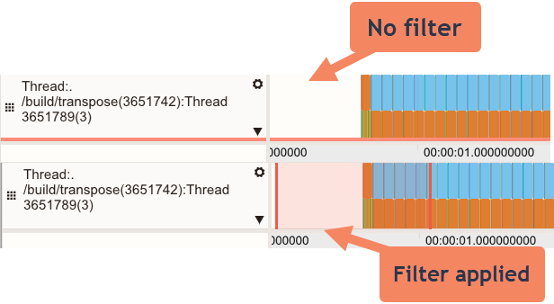

Double-click in the **Timeline View** again to clear the selection.

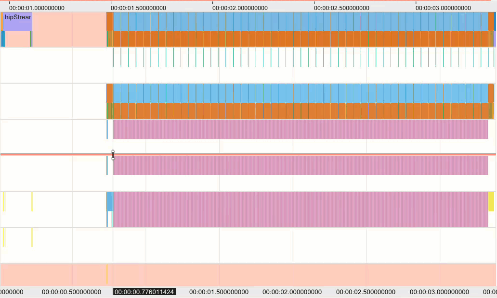

The active time range filter applies to Event and sample Counter details in the :ref:`advanced` section.

Save trace selections
---------------------

When there's an active time range filter, the trace can be trimmed from the **Edit** > **Save Trace Selection** menu option:

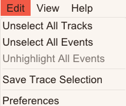

This creates a new trace file containing only the events in the filter.

.. _annotation:

Add an annotation
=================

Annotations are customized notes you can add to any area of the :ref:`timeline`.

To add an annotation:

1. Click **+** from the **Annotations** section of the toolbar:

   .. image:: ../images/add-annotation.png
      :width: 200

   Annotations can also be added by right-clicking on the **Timeline View** and clicking the **Add Annotation** context menu option.

2. The **Annotation** modal displays. Provide a title and your note, then click **Save** to create the annotation.

   .. image:: ../images/save-annotation.png
      :width: 500

   Once saved, the annotation displays on the timeline:

   .. image:: ../images/annotation-example.png
      :width: 500

.. tip::

  - The annotation can be edited or deleted by clicking |pen|.
  - A complete list of annotations can be viewed in the **Annotations** tab of the :ref:`advanced` section.
  - Check the **Visibility** option in the **Annotations** tab to toggle the visibility of individual annotations.
  - Clicking on a row in the annotations list will bring the selected annotation into view.

Create bookmarks
================

The current view on the timeline (scroll and zoom position) can be saved to a bookmark for quick navigation.

To create and use a bookmark:

1. Click **+** on the |book| drop-down menu from the main **Toolbar**.
2. Select the bookmark number to navigate to the selected bookmark.
   
Or:

1.	Press **Ctrl** + any key from **0** ‒ **9** to create a view bookmark. The bookmark saves to an index based on the number used and creates a shortcut.
2.	Press any key from **0** ‒ **9** to restore the view to a stored bookmark from that index number shortcut. For example, if you save a bookmark using **Ctrl** + **1**, pressing **1** restores that bookmark.

Delete bookmarks
----------------

To delete a bookmark, click **X** to delete a bookmark from the |book| drop-down menu. Click **Reset View** to return the :ref:`timeline` to its original pan and zoom settings.

Change display settings
=======================

You can change these global display settings for ROCm Optiq from the **Settings** menu:

The application theme display (Light or Dark mode) or the font scaling: either automatic based on the display DPI, or customized using the font size control.

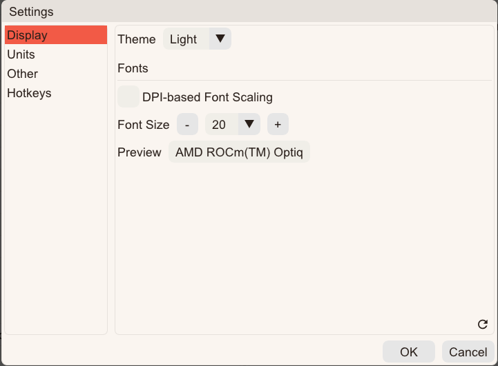

The time unit settings displayed on the **Timeline View**.

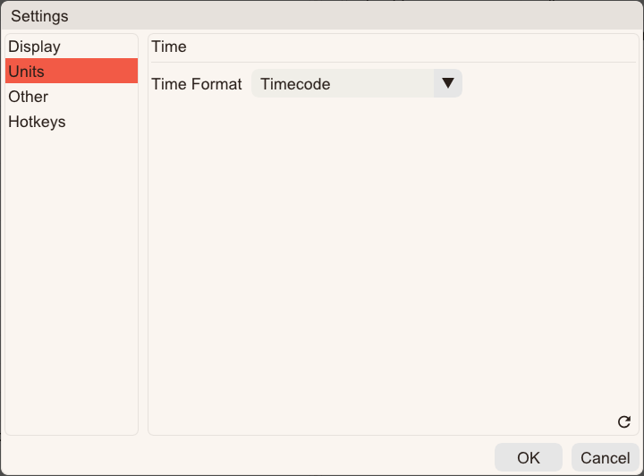

Customize timeline display options
----------------------------------

Customize display options for each track by clicking the gear icon in the track's **Description** in the :ref:`timeline`:

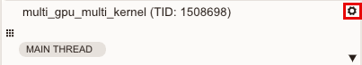

- For event tracks, you can toggle between **Color by name** and **Compact mode**.

  - **Color by name**: Change the coloring method used to color the events.
  - **Compact Mode**: Shrink the event heights so that tall flame graphs can be displayed in a smaller area.

- For sample counter tracks, you can toggle between **Show Counter Boxes**, **Alternate Counter Coloring**, and **Highlight Y Range**:

  - **Show Counter Boxes**: Display as a line only, or fill the area under the line as well.
  - **Alternate Counter Coloring**: If the area under the line is filled, alternate the fill color for each sample.
  - **Highlight Y Range**: Select an area of the graph to highlight. Choose the min and max range that you want to highlight. The tool highlights these values on the track region.

    .. image:: ../images/timeline-display-options.png
       :width: 400  
  
- For sample counter tracks, you can set the min and max when showing the tracks: 

  - Click on the value beside the min and max to set/change the scale range. 
  - Click the reset |reset| button to restore the values to their default.

  .. image:: ../images/min-max.png
     :width: 400

Set the flow rendering display mode
===================================

Use the **Flow** buttons on the **Toolbar** to show and hide flow information on the :ref:`timeline`, or change the flow display mode from Render (fan) to Chain mode. 

|flow|

Chain mode displays events in a linked sequence, emphasizing dependencies and execution order. This is useful when analyzing how operations are chained together across queues or streams.

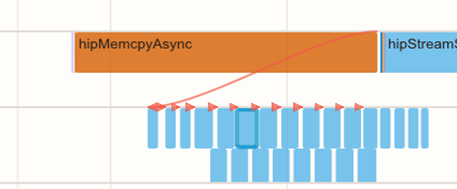

Render mode Shows events in a fan-out style, highlighting parallelism and branching. This helps visualize concurrency and how multiple operations originate from a single source.

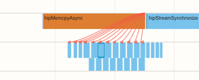

.. note::

  Chain mode and Render mode are visualization modes for relations; they don't represent the actual kernel scheduling flow.

Show/hide Optiq panels
======================

The **View** menu can be used to show/hide the various panels of the application.

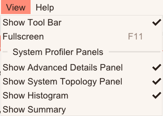
