.. meta::
  :description: Learn how to customize your ROCm Optiq project.
  :keywords: Optiq, ROCm, customize, filter, bookmarks, annotations

.. _customize:

*********************************
Customize your ROCm Optiq project
*********************************

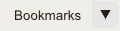

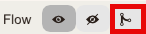

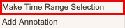
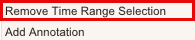

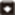

You can customize display settings, filters, bookmarks, and more in your ROCm Optiq projects.

.. _change-settings:

Change settings
===============

You can adjust the settings in your ROCm Compute Profiler and ROCm Systems Profiler projects.

Select **Edit** > **Preferences** to adjust these global settings for ROCm Optiq from the **Settings** menu: 

- The application theme display (Light or Dark mode).
- The font scaling: automatic based on the display DPI, or customized using the font size control:

  .. image:: ../images/settings.png
     :width: 600

- The time unit settings displayed on the **Timeline View**:

  .. image:: ../images/units.png
     :width: 600

- The hotkey settings allow keyboard shortcuts to be redefined:

  .. image:: ../images/hotkeys.png
     :width: 600

Show/hide panels
================

Use the **View** menu to show and hide application panels.

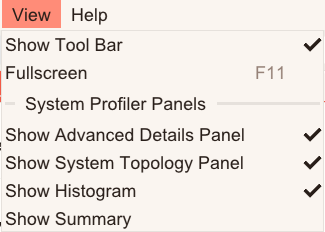

Customize projects for ROCm Systems Profiler traces
==============================================================

You can customize the data views of an open ROCm Systems Profiler trace file in ROCm Optiq, including timeline display settings, saved trace selections, added bookmarks/annotations, and more.

.. note::

   These settings only apply to ROCm Systems Profiler trace projects. They don't apply to ROCm Compute Profiler projects.

.. _time-range-filter:

Set a time range filter
-----------------------

Set a time range filter in the :ref:`timeline` to limit the data displayed to a specific period. 

To set a time range filter, press and hold **Ctrl** while dragging your mouse in the **Timeline View** to select a range.

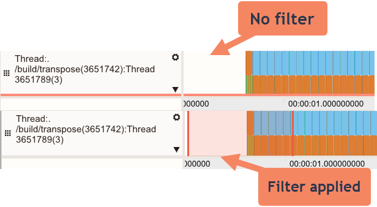

Once a time range is selected, the selection boundaries can be adjusted by dragging them. 
The active time range filter applies to event and sample counter details in the :ref:`advanced` section.

If one or more events are selected, the **Make Time Range Selection** option displays on the timeline context menu when you right-click:

|make|

Selecting this sets a time-range filter with boundaries at the event's start and end times, or at the first start time and last end time if multiple events are selected. 

.. tip::

   Press **M** for a shortcut to **Make Time Range Selection** when one or more events are selected.  

To clear the time range selection, press **Esc** or right-click and select **Remove Selection**:

|remove|

Save trace selections
~~~~~~~~~~~~~~~~~~~~~

When there's an active time range filter, select **Edit** > **Save Trace Selection** to trim the trace:

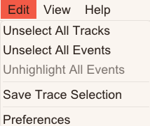

This creates a new trace file containing only the events in the filter.

.. _annotation:

Add an annotation
-----------------

Annotations are customized notes you can add to any area of the :ref:`timeline`.

To add an annotation:

1. Click **+** from the **Annotations** section of the toolbar:

   .. image:: ../images/add-annotation.png
      :width: 200

   Annotations can also be added by right-clicking on the **Timeline View** and clicking the **Add Annotation** context menu option.

2. The **Annotation** dialog displays. Provide a title and your note, then click **Save** to create the annotation.

   .. image:: ../images/save-annotation.png
      :width: 500

   Once saved, the annotation displays as a marker that can be expanded on the timeline:

   .. image:: ../images/annotation-example.png
      :width: 200

.. tip::

  - Edit or delete the annotation by clicking |pen|.
  - View the complete list of annotations in the **Annotations** tab of the :ref:`advanced` section.
  - Check the **Visibility** option in the **Annotations** tab to toggle the visibility of individual annotations.
  - Clicking a row in the annotations list displays the selected annotation.

Create bookmarks
----------------

The current view on the timeline (scroll and zoom position) can be saved to a bookmark for quick navigation.

To create and use a bookmark:

1. Click **+** in the |book| menu from the main **Toolbar**.
2. Select the bookmark number to navigate to it.
   
Or:

1.	Press **Ctrl** + any key from **0** - **9** to create a view bookmark. The bookmark saves to an index based on the number used and creates a shortcut.
2.	Press any key from **0** - **9** to restore the view to a stored bookmark from that index number shortcut. For example, if you save a bookmark using **Ctrl** + **1**, pressing **1** restores that bookmark.

Delete bookmarks
~~~~~~~~~~~~~~~~

- To delete a bookmark, click **X** to delete a bookmark from the |book| menu. 
- Click **Reset View** to return the :ref:`timeline` to its original pan and zoom settings.

Customize timeline display options
----------------------------------

Customize display options for each track by clicking the gear icon in the track's **Description** in the :ref:`timeline`:

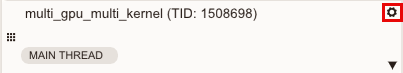

- For event tracks, you can toggle between **Color by name**, **Color by Time Level**, **No Color**, and **Compact mode**.

  - **Color by name**, **Color by Time Level**, and **No Color***: Change the coloring method used to color the events.
  - **Compact Mode**: Shrink event heights to display tall flame graphs in a smaller area.

- For sample counter tracks, you can toggle between **Show Counter Boxes**, **Alternate Counter Coloring**, and **Highlight Y Range**:

  - **Show Counter Boxes**: Display as a line only, or fill the area under the line as well.
  - **Alternate Counter Coloring**: If the area under the line is filled, alternate the fill color for each sample.
  - **Highlight Y Range**: Select an area of the graph to highlight. Choose the minimum and maximum range that you want to highlight. The tool highlights these values on the track region.

    .. image:: ../images/timeline-display-options.png
       :width: 400  
  
- For sample counter tracks, you can set the min and max when showing the tracks: 

  - Click on the value beside the min and max to set/change the scale range. 
  - Click |reset| to restore the values to their default.

  .. image:: ../images/min-max.png
     :width: 400

Set the flow rendering display mode
-----------------------------------

Use the **Flow** buttons on the toolbar to show and hide flow information on the :ref:`timeline`, or change the flow display mode from Render (fan) to Chain mode. 

|flow|

Chain mode displays events in a linked sequence, emphasizing dependencies and execution order. This is useful when analyzing how operations are chained together across queues or streams.

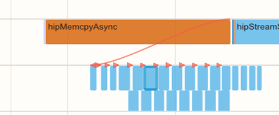

Render mode shows events in a fan-out style, highlighting parallelism and branching. This helps visualize concurrency and how multiple operations originate from a single source.

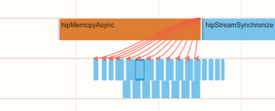

.. note::

  Chain mode and Render mode are visualization modes for relations. They don't represent the actual kernel scheduling flow.

Save a project file
-------------------

Persist the customizations made to tracks, bookmarks, and annotations by saving the session as a project  (``.rpv`` file). 

- Select **File** > **Save As** to create a new project.
- Select **File** > **Save** to overwrite the currently opened project.

Remove Optiq-specific metadata from an open trace file
------------------------------------------------------

You can remove metadata added by ROCm Optiq during processing trace data by selecting **File > Database > Full Cleanup**.

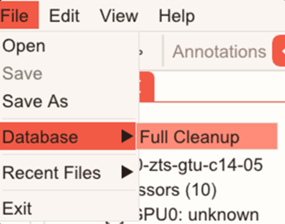

Customize projects for ROCm Compute Profiler Analysis Data
==========================================================

.. _presets:

Presets
-------

Persist the pinned metric configurations for the Table View and Baseline Comparison by saving them as a preset. To do this, go to **Presets**, enter a preset name into the **New Preset Name** field, then click |plus|.

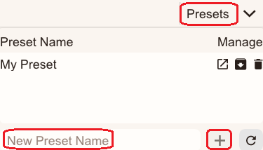

After a preset is saved, you can:

- Recall it by clicking |recall| in the preset's row.
- Overwrite it by clicking |overwrite|.
- Delete it by clicking |delete|.  