.. meta::
  :description: Learn how to customize ROCm Optiq: add bookmarks and annotations, adjust track display options, and save presets.
  :keywords: Optiq, ROCm, customize, filter, bookmarks, annotations

.. _customize:

********************
Customize ROCm Optiq
********************

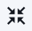
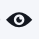
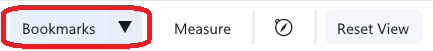

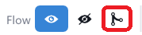

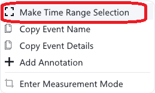
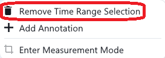
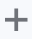
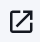
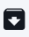
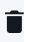

You can customize display settings, filters, bookmarks, and more in your ROCm Optiq projects.

.. _change-settings:

Change settings
===============

You can adjust the settings in your ROCm Compute Profiler and ROCm Systems Profiler projects.

Use the **Edit** > **Preferences** menu to open the **Settings** dialog. The following settings can be adjusted: 

- The application theme (Light or Dark).
- The multi-node decorators visibility. This controls whether to enable node colors in the:ref:`topology` view and node labels in the track descriptions.
- The topology sidebar icon button visibility. This controls whether the |eye| (show/hide track) and |scroll| (go to track) icon buttons display in the sidebar of the :ref:`topology`.
- The font size.

  .. image:: ../images/settings.png
     :width: 600
     :alt: ROCm Optiq Settings panel showing theme and font scaling controls

- The time unit settings displayed on the **Timeline View**:

  .. image:: ../images/units.png
     :width: 600
     :alt: ROCm Optiq Settings panel showing the time unit selector for the Timeline View

- The hotkey settings allow keyboard shortcuts to be redefined:

  .. image:: ../images/hotkeys.png
     :width: 600
     :alt: ROCm Optiq Settings panel showing the hotkey configuration table for customizing keyboard shortcuts

Show/hide panels
================

Use the **View** menu to show and hide application panels.

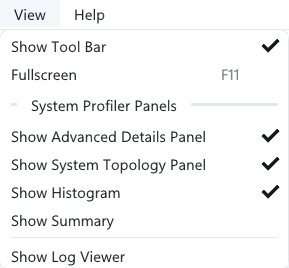

Customize projects for ROCm Systems Profiler traces
===================================================

You can customize the data views of an open ROCm Systems Profiler trace file in ROCm Optiq, including timeline display settings, bookmarks, annotations, and more.

.. note::

   These settings only apply to ROCm Systems Profiler trace projects. They don't apply to ROCm Compute Profiler projects.

.. _annotation:

Add an annotation
-----------------

Annotations are customized notes you can add to any area of the :ref:`timeline`.

To add an annotation:

1. Click **+** from the **Annotations** section of the toolbar:

   .. image:: ../images/add-annotation.png
      :width: 200
      :alt: Annotations toolbar section with the plus button for adding a new annotation

   Annotations can also be added by right-clicking on the **Timeline View** and clicking the **Add Annotation** context menu option.

2. The **Annotation** dialog displays. Provide a title and your note, then click the **X** button to close the note and create the annotation.

   .. image:: ../images/save-annotation.png
      :width: 200
      :alt: Annotation dialog showing title and note text fields with a Save button

   Once saved, the annotation displays as a marker that can be expanded on the timeline.

   Annotations are track-bound and follow their tracks when scrolling, reordering, or rearranging the timeline. 
   Expanded notes open as movable floating windows with inline editing; empty notes are discarded automatically. 
   A time guide line appears while a note is hovered or dragged. 
   
   .. image:: ../images/new-annotation-example.png
      :width: 800
      :alt: Timeline showing an expanded annotation note as a floating window with inline editing

   The **Annotations** tab in the **Advanced Details** section shows a list of annotations.  
   Each row shows the annotation title, the note, the track it is attached to, its start time, and a checkbox for visibility.
   Clicking a row brings the selected annotation into view on the timeline.
   You can use **Lock Annotation** to lock an annotation to prevent accidental drag or rebind. You can choose **Go-to-Anchor** to bring the view back to the annotation's anchor point.

.. tip::

  - View the complete list of annotations in the **Annotations** tab of the :ref:`advanced` section.
  - Check the **Visibility** option in the **Annotations** tab to toggle the visibility of individual annotations.
  - Clicking a row in the annotations list brings the selected annotation into view on the timeline.

Create bookmarks
----------------

The current view on the timeline (scroll and zoom position) can be saved to a bookmark for quick navigation.

To create and use a bookmark:

1. Click **+** in the |book| menu from the main **Toolbar**.
2. Select the bookmark number to navigate to it.
   
Or:

1.	Press **Ctrl** + any key from **0** - **9** to create a view bookmark. The bookmark saves to an index based on the number used and creates a shortcut.
2.	Press any key from **0** - **9** to restore the view to a stored bookmark from that index number shortcut. For example, if you save a bookmark using **Ctrl** + **1**, pressing **1** restores that bookmark.

Delete bookmarks
~~~~~~~~~~~~~~~~

Use the following actions to delete bookmarks or reset the view.

- Select **X** to delete a bookmark from the |book| menu. 
- Select **Reset View** to return the :ref:`timeline` to its original pan and zoom settings.

Customize timeline display options
----------------------------------

Customize display options for each track by right clicking the **Description** area to open the track's context menu. Select **Track Options** to customize the track's display options.

- For event tracks, you can toggle between **Color by Name**, **Color by Time Level**, **No Color**, and **Compact mode**.

  - **Color by Name**: All events with the same name share a color. 
  - **Color by Time Level**: Events with the same name but different start times have different colors. 
  - **No Color**: Events render without name-based coloring. 
  - **Compact mode**: Shrink event track heights to display tall flame graphs in a smaller area. 

   .. image:: ../images/track-options.png
      :width: 600
      :alt: Timeline track context menu options

- For sample counter tracks, you can toggle between **Show Counter Boxes**, **Alternate Counter Coloring**, and **Highlight Y Range**:

  - **Show Counter Boxes**: Display as a line only, or fill the area under the line as well.
  - **Alternate Counter Coloring**: If the area under the line is filled, alternate the fill color for each sample.
  - **Highlight Y Range**: Select an area of the graph to highlight. Choose the minimum and maximum range that you want to highlight. The tool highlights these values on the track region.

   .. image:: ../images/timeline-display-options.png
      :width: 600
      :alt: Track display options menu for a sample counter track showing Show Counter Boxes, Alternate Counter Coloring, and Highlight Y Range toggles

- For sample counter tracks, you can set the min and max when showing the tracks: 

  - Click on the value beside the min and max to set/change the scale range. 
  - Click |reset| to restore the values to their default.

  .. image:: ../images/min-max.png
     :width: 1000
     :alt: Sample counter track showing editable minimum and maximum scale values with a reset button

.. tip::

   The context menu when right-clicking a track's description in **Timeline View** also provides **Copy track name** and **Copy track ID**. 
   You can select multiple tracks and apply a **Track Options** change to all selected tracks at once instead of repeating the change per track.

Set the flow rendering display mode
-----------------------------------

Use the **Flow** buttons on the toolbar to show and hide flow information on the :ref:`timeline`, or change the flow display mode from Render (fan) to Chain mode. 

|flow|

Chain mode displays events in a linked sequence, emphasizing dependencies and execution order. This is useful when analyzing how operations are chained together across queues or streams.

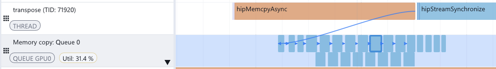
   
Fan mode shows events in a fan-out style, highlighting parallelism and branching. This helps visualize concurrency and how multiple operations originate from a single source.

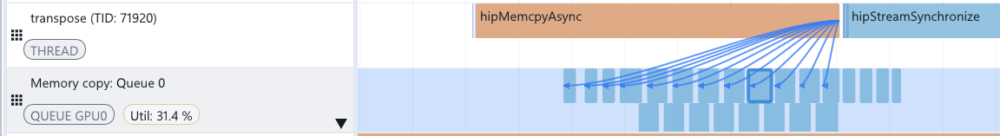

.. note::

  Chain mode and Fan mode are visualization modes for relations. They don't represent the actual kernel scheduling flow.

Save a project file
-------------------

Persist the customizations made to tracks, bookmarks, and annotations by saving the session as a project  (``.rpv`` file). 

- Select **File** > **Save As** to create a new project.
- Select **File** > **Save** to overwrite the currently opened project.

Remove Optiq-specific metadata from an open trace file
------------------------------------------------------

You can remove metadata added by ROCm Optiq during processing trace data by selecting **File > Database > Full Cleanup**.

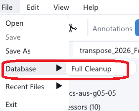

Customize views for ROCm Compute Profiler analysis data
==========================================================

.. _presets:

Presets
-------

Persist the pinned metric configurations for the Table View and Baseline Comparison by saving them as a preset. To do this, go to **Presets**, enter a preset name into the **New Preset Name** field, then click |plus|.

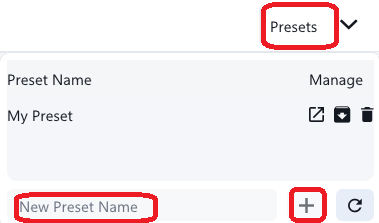

After a preset is saved, you can:

- Recall it by clicking |recall| in the preset's row.
- Overwrite it by clicking |overwrite|.
- Delete it by clicking |delete|.  