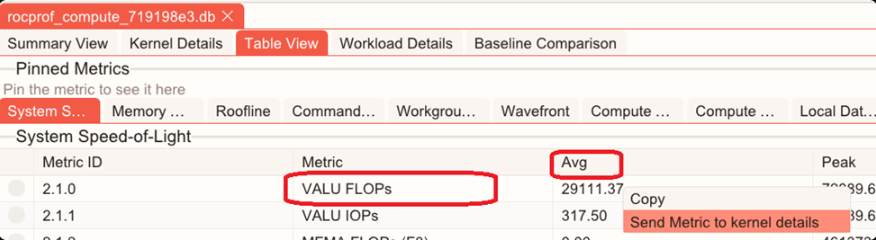
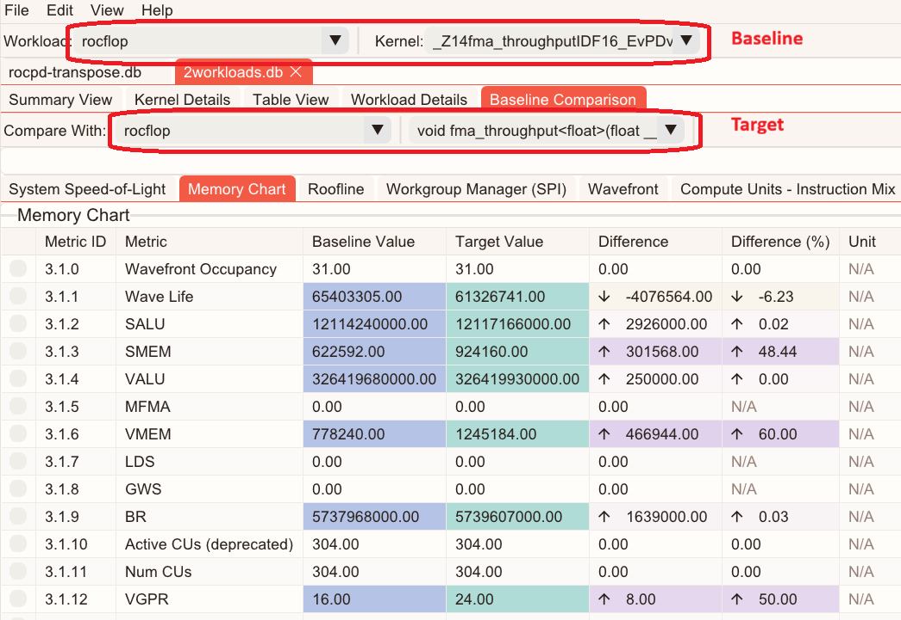
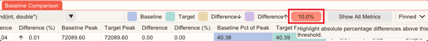

.. meta::
  :description: Learn how to view ROCm Compute Profiler analysis data in ROCm Optiq.
  :keywords: Optiq, ROCm, analysis, profiler, data,

.. _view-analysis:

******************************************************
View ROCm Compute Profiler analysis data in ROCm Optiq
******************************************************

.. |eye| image:: ../images/eye.png
.. |gear| image:: ../images/gear.png

ROCm Optiq provides intuitive, interactive profiling analysis for compute workloads by moving from a high-level performance summary to detailed kernel- and metric-level analysis. 
ROCm Optiq provides intuitive, interactive profiling and analysis for compute workloads, moving from high-level performance summaries to detailed kernel- and metric-level analysis. 
It enables rapid identification of performance hotspots and interactive exploration of kernel-level metrics for a profiled workload.

.. note::

   See the `ROCm Compute Profiler documentation <https://rocm.docs.amd.com/projects/rocprofiler-compute/en/latest/index.html>`_ for more information.

Open a ROCm Compute Profiler database file
==========================================

ROCm Optiq supports the ROCm Compute Profiler analysis database format (``.db``).  

Select **File** > **Open** to open a database file. 
You can also open files by dragging them into the application window. 

Troubleshooting
---------------

If the analysis database file doesn't open, it might be in an unsupported format. 
To generate profiling data in a compatible format, run the CLI analysis with the ``--output-format`` option set to the ROCm Compute analysis database format: 

.. code:: 

  rocprof-compute analyze --output-name your-datafile-name --output-format db -p </path/to/workload>

When you open a ROCm Compute Profiler analysis database file, you can view its data populated in :ref:`analysis-summary`, :ref:`kernel-details`, :ref:`analysis-table`, and :ref:`analysis-workload`.

.. _analysis-summary:

Summary View
============

The **Summary View** displays a high-level overview of the captured data. 

Summary View -- Table
---------------------
 
The table in **Summary View** lists the top 10 longest-running kernels sorted by Total Execution Time. 
The table displays kernel names, the number of invocations, and statistics including Total, Min, Max, Mean, and Median durations.  

.. image:: ../images/summary-view-table.png
   :width: 800
   :align: center

Summary View -- Charts
----------------------

Charts display as bar or pie charts.

The pie chart plots: 

- **Total Duration**: The total duration as a percentage for the kernels. 
- **Invocation(s)**: The number of invocations as a percentage for the kernels. 

.. image:: ../images/summary-view-pie-chart.png
   :width: 800
   :align: center

.. tip::
   
   The kernel name and duration are displayed when you hold your cursor over a section of the pie chart. 

The bar chart displays per-kernel metrics including the number of invocations, and the Total, Min, Max, Mean, and Median duration data. 

.. image:: ../images/summary-view-bar-chart.png
   :width: 800
   :align: center

Selected kernels are highlighted in white in both charts.  

Summary View -- Roofline Chart
------------------------------

The chart plots kernel performance against empirical hardware ceilings to reveal the dominant performance bottleneck for all kernels.
Showing where kernels are positioned relative to these rooflines helps determine whether performance is memory-bound or compute-bound, and identify the most impactful optimization direction. 

.. image:: ../images/summary-view-roofline-analysis.png
   :width: 800
   :align: center

- The kernel performance at each cache level is displayed as individual dots in the roofline chart. The size of each dot represents the kernel's duration. 
- Click |gear| in the menu to show or hide rooflines or arithmetic intensity points. 
- Hold your cursor over a dot to view detailed information about the kernel it represents. The information includes the Kernel name, Invocation(s), Duration, Arithmetic Intensity, and Performance. 
- Use presets to display information specific to a particular data type. 
- Use the Roofline **Legend/Menu position** control options to reposition the Roofline Legend/Menu. The options include: 

  - Inside, Top Left
  - Inside, Top Right
  - Inside, Bottom Left
  - Inside, Bottom Right
  - Outside (which pushes the legend outside of the plot area)

  .. image:: ../images/Roofline-legend.png
     :width: 800
     :align: center

.. _kernel-details:

Summary View -- System Speed-of-Light
-------------------------------------

- Provides an aggregated, system-level summary of key performance and hardware utilization metrics across all kernels, highlighting utilization relative to architectural peak capabilities. 
- The Summary View -- System Speed-of-Light table includes the following columns: **Metric ID**, **Metric Name**, **Average Value**, **Peak, Percent-of-Peak**, and **Unit**. 
- Metrics are aggregated across kernels to reflect overall application behavior rather than per-kernel performance. 
- Use the **Percent-of-Peak** column to quickly identify whether execution is limited. Execution could be limited by compute, memory, or other hardware subsystems. 
- Hover over a metric name to see a tooltip with a detailed description. 

Kernel Details
==============

**Kernel Details** focuses on one kernel at a time. It has these components:  

- **Kernel Selection Table**: Helps you identify and choose a kernel of interest for further analysis.  
- **Memory Chart**: Displays a visual diagram of the hardware with overlapping per-block metrics. 
- **System Speed-of-Light**: A table view of kernel metrics with their unit, average, peak, and percentage of peak values.  
- **Roofline analysis**: Displays kernel performance relative to the system's capabilities for the selected kernel. 

Kernel Details -- Kernel Selection Table
----------------------------------------

The **Kernel Selection Table** displays kernel information, including names and GPU metrics.  

.. image:: ../images/kernel-selection-table.png
   :width: 800
   :align: center

- Click **Add Metric** to select additional GPU metrics as columns. 
- The search box below each column's header allows you to enter statements to filter the data, enabling targeted analysis. Click **Apply Filters** to execute. You can search for a kernel by name or metric equation.  

  - For the **Name** column, use this format: ``LIKE %text%``. 
  - For all other metrics, use: ``>,<,=,>=,<=,!= number``. For example, ``metricA>threshold``. 
  - You can combine multiple filters to narrow down the analysis. 

- The Duration column enables you to sort (ascending or descending).  
- Selecting a kernel through the **Kernel Selection Table** or kernel selector drop-down updates the Memory Chart, System Speed-of-Light, Kernel-level Roofline Analysis, and Table View accordingly. 
- You can hide this table by clicking |eye| to maximize space for charts.
- To show or hide bar charts for metric values in the **Kernel Selection Table**, select **Show Bar Charts** or **Hide Bar Charts**.  
- To show or hide bar charts for a specific metric, right-click the metric's column header and select **Show Bar Chart** or **Hide Bar Charts**. 
- Hover over a clipped kernel name to view the full name in a tooltip. 

Kernel Details -- Memory Chart
------------------------------

The **Memory Chart** displays memory transactions and throughput at each cache hierarchy level. Each cache level presents its associated counter values and derived metrics, helping users understand memory behavior across the hardware memory hierarchy.

.. image:: ../images/memory-chart.png
   :width: 800
   :align: center

This visual diagram displays counter values and calculations to help you understand which cache level each memory transaction corresponds to and how they interact.  

Select a kernel in the **Kernel Selection Table** or the kernel selector drop-down to view the memory chart of the selected kernel. 

Kernel Details -- System Speed-of-Light 
---------------------------------------

The **System Speed-of-Light** displays key kernel-level performance metrics to show the overall compute performance and hardware utilization.  

.. image:: ../images/speed-of-light.png
   :width: 800
   :align: center

Kernel Details -- Kernel Roofline Chart
---------------------------------------

The **Kernel Roofline Chart** displays a kernel-specific roofline analysis, which helps you determine whether the kernel is compute-bound or memory-bound. 

- Click |gear| to show or hide rooflines or arithmetic intensity points. 
- Hold your cursor over a dot to view detailed information of the kernel. 
- Use the **Menu** position control to choose options to reposition the Roofline Legend/Menu.

.. _analysis-table:

Table View 
==========

The **Table View** displays a complete list of available metrics for the selected kernel. 

.. image:: ../images/analysis-table-view.png
   :width: 800
   :align: center

Metrics are grouped into tabs that match compute categories, including: 

- Compute Units - Instruction Mix 
- System Speed-of Light 
- Compute Units - Compute Pipeline 
- Memory Chart 
- Roofline Performance Rates 
- Command Processor (CPC/CPF) 
- Work Group Manager (SPI) 
- Wavefront 
- Local Data Share (LDS) 
- Instruction Cache 
- Scalar L1 Data Cache 
- Address Processing Unit and Data Return Path (TA/TD) 
- Vector L1 Data Cache 
- L2 Cache 
- L2 Cache (per channel) 

You can pin a metric for focused analysis by selecting the checkbox beside the metric. Pinned metric configurations can be saved to be persisted across sessions (see :ref:`Presets` for more information).

You can add a metric to the Kernel Details by right-clicking that metric in Table View and selecting **Send Metric to kernel details**. 
Here's an example:

Clicking the **Avg** cell of the **VALU FLOPs** adds the VALU FLOPs average to the Kernel Selection Table.

.. _analysis-workload:

Workload Details 
================

**Workload Details** provides contextual information about the workload, such as:

- **System information**: Hardware details of the system at the time the profiling data was collected. 
- **Profiling configuration**: ROCm Compute Profiler parameters and settings used when the data was captured. 

.. image:: ../images/workload-details.png
   :width: 800
   :align: center

.. _baseline-comparison:

Baseline Comparison
===================

The **Baseline Comparison** shows performance differences between two workload measurements (baseline and target) side-by-side. It's useful for scenarios such as: 

- Comparing results before and after optimization or tuning changes. 
- Measuring the impact of code, algorithm, or kernel changes. 
- Evaluating the effect of environment updates. 
- Validating performance stability across multiple runs. 

**Baseline Comparison** presents a unified table of available metrics for both runs, making it easy to identify regressions, improvements, and other behavior changes. 

Use the drop-down menus to select the baseline, target workload, and kernel. The comparison table updates to show statistics for the selected selections. 
You can also compare two kernels within the same workload.

Choose how metrics are displayed by selecting **Show Common Metrics** or **Show All Metrics**. You can also pin metrics for focused analysis. Pinned metrics can be persisted across sessions (See :ref:`presets` for more information).

For each metric, **Baseline Comparison** shows: 

- Baseline statistics available in the database (for example, average, median, minimum, and maximum). 
- Target statistics available in the database (for example, average, median, minimum, and maximum). 
- The difference (delta) between baseline and target values. 
- The percentage change between baseline and target values. 
- The **Baseline**, **Target**, **Difference**, and **Difference (%)** columns are color-coded to make changes easy to spot and quantify.
- A combination of side-by-side statistics with clear delta reporting to provide a fast way to understand performance trends across workloads.

You can configure a delta-threshold for comparison metrics to suppress the noise of minor deviations or filter out changes below a certain level.

.. note::

   - To compare two runs in ROCm Optiq, both sets of analysis results must be present in the same database.

   - To generate a database that contains multiple workloads with ROCm Compute Profiler for comparison, profile each workload and then run analysis with database output enabled: 

     .. code::

       $ rocprof-compute profile -n <workload_name_1> -- <application> 
       ... 
       $ rocprof-compute profile -n <workload_name_N> -- <application> 

       $ rocprof-compute analyze -p <path to workload_name_1> ... -p <path to workload_name_N> --output-format db 

     Copy the generated ``.db`` file to the host system and open it in ROCm Optiq. Then, go to the **Baseline Comparison** tab and select a baseline workload under **Workload:** and a target workload under **Compare With:**. Select a kernel for each workload to compare. 