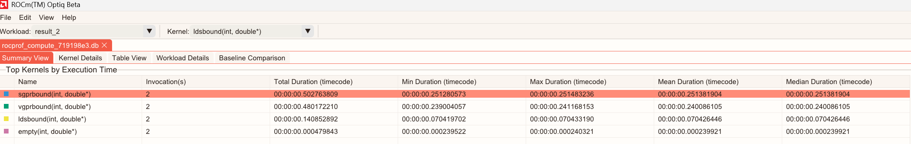
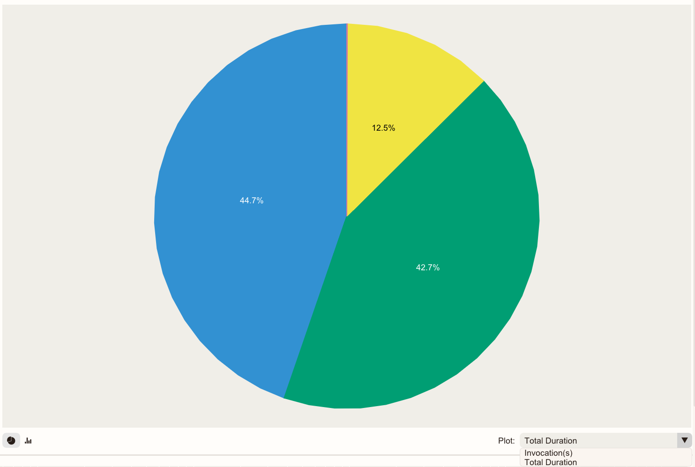
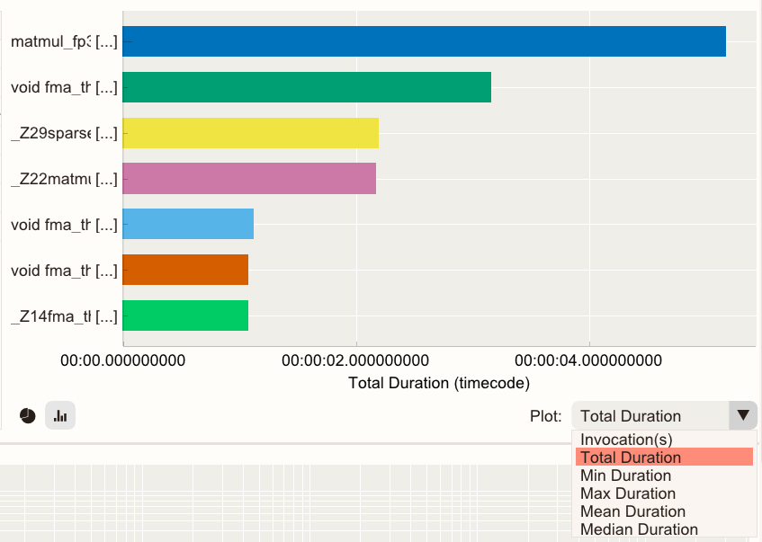
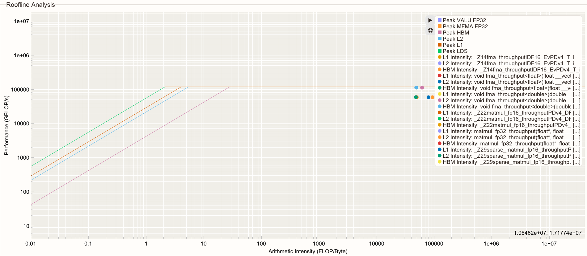
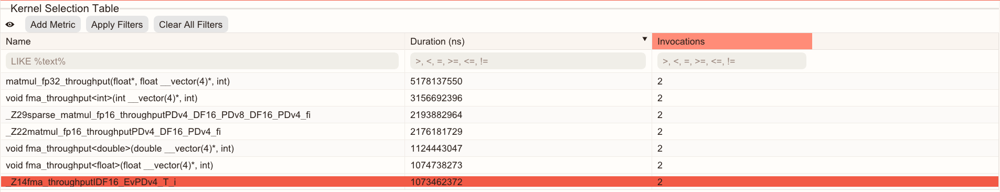
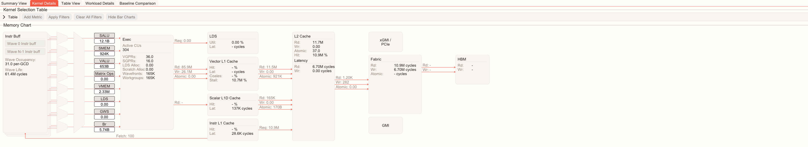
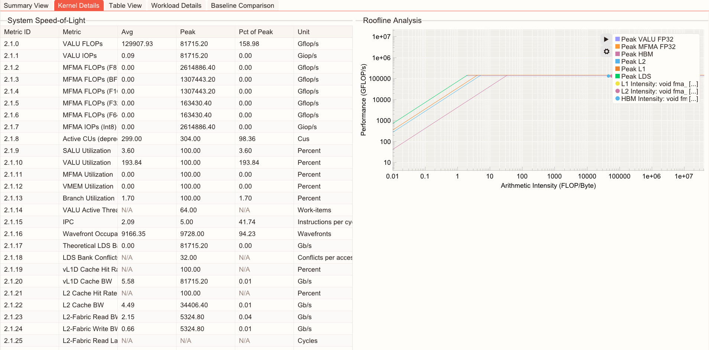
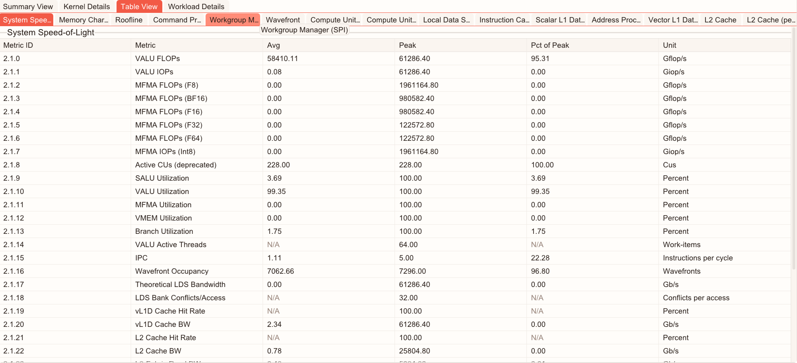
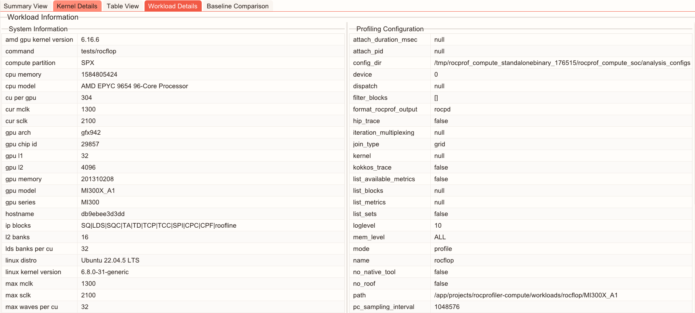

.. meta::
  :description: Learn how to view ROCm Compute Profiler analysis data in ROCm Optiq.
  :keywords: Optiq, ROCm, analysis, profiler, data,

.. _view-analysis:

******************************************************
View ROCm Compute Profiler analysis data in ROCm Optiq
******************************************************

ROCm Optiq provides intuitive, interactive profiling analysis for compute workloads by moving from a high-level performance summary to detailed kernel- and metric-level analysis. 
It enables rapid identification of performance hotspots and interactive exploration of kernel-level metrics for a profiled workload.

Open a ROCm Compute Profiler database file
==========================================

ROCm Optiq supports the ROCm Compute Profiler analysis database format (``.db``).  

Select **File** > **Open** to open a database file. 
You can also open files by dragging them into the application window. 

Troubleshooting
---------------

If the analysis database file doesn't open, it might be in an unsupported format. 
To generate profiling data in a compatible format, run the CLI analysis with the ``--output-format`` option set to the ROCm Compute analysis database format: 

.. code:: 

  rocprof-compute analyze --output-name your-datafile-name --output-format db -p </path/to/workload>

When you open a ROCm Compute Profiler analysis database file, you can view its data populated in :ref:`analysis-summary`, :ref:`kernel-details`, :ref:`analysis-table`, and :ref:`analysis-workload`.

.. _analysis-summary:

Summary View
============

The **Summary View** displays a high-level overview of the captured data. 

Table
-----
 
The table in **Summary View** lists the top 10 longest-running kernels sorted by Total Execution Time. 
The table displays kernel names, the number of invocations, and statistics including Total, Min, Max, Mean, Median durations.  

Charts
------

Charts display as bar or pie charts.

The pie chart plots: 

- **Total Duration**: The total duration as a percentage for the kernels. 
- **Invocation(s)**: The number of invocations as a percentage for the kernels. 

.. tip::
   
   The kernel name and duration are displayed when you hold your cursor over a section of the pie chart. 

The bar chart displays per-kernel metrics including the number of invocations, Total, Min, Max, Mean, and Median duration data. 

Selected kernels are highlighted white in both charts.  

Summary View Roofline Chart
---------------------------

The chart plots kernel performance against empirical hardware ceilings to reveal the dominant performance bottleneck for all kernels.
Showing where kernels are positioned relative to these rooflines helps determine whether performance is memory-bound or compute-bound, and identify the most impactful optimization direction. 

Kernel performance at each cache level is displayed as individual dots in the roofline chart.  
The size of each dot represents the kernel's duration. 

Click |gear| in the menu to show or hide rooflines or arithmetic intensity points. 

Hold your cursor over a dot to view detailed information about the kernel it represents. 
The information includes the Kernel name, Invocation(s), Duration, Arithmetic Intensity, and Performance. 

There are also presets available to display information specific to a particular data type. 

.. _kernel-details:

Kernel Details
==============

**Kernel Details** focuses on one kernel at a time. It has these components:  

- **Kernel Selection Table**: Helps you identify and choose a kernel of interest for further analysis.  
- **Memory Chart**: Displays a visual diagram of the hardware with overlapping per-block metrics. 
- **System Speed-of-Light**: A table view of kernel metrics with their unit, average, peak, and percentage of peak values.  
- **Roofline analysis**: Displays kernel performance relative to the system's capabilities for the selected kernel. 

Kernel Selection Table
----------------------

The **Kernel Selection Table** displays kernel information, including names and GPU metrics.  

- Click **Add Metric** to select additional GPU metrics as columns. 
- The search box below each column's header allows you to enter statements to filter the data, enabling targeted analysis. Click **Apply Filters** to execute. You can search for a kernel by name or metric equation.  

  - For the **Name** column, use this format: ``LIKE %text%``. 
  - For all other metrics, use: ``>,<,=,>=,<=,!= number``. For example, ``metricA>threshold``. 
  - You can combine multiple filters to narrow down the analysis. 

- The Duration column enables you to sort (ascending or descending).  
- Selecting a kernel through the **Kernel Selection Table** or kernel selector drop-down updates the Memory Chart, System Speed-of-Light, Kernel-level Roofline Analysis, and Table View accordingly. 
- You can hide this table clicking |eye| to maximize space for charts.

Memory Chart
------------

The **Memory Chart** displays memory transactions and throughput at each cache hierarchy level. Each cache level presents its associated counter values and derived metrics, helping users understand memory behavior across the hardware memory hierarchy.

This visual diagram displays counter values and calculations to help you understand which cache level each memory transaction corresponds to and how they interact.  

Select a kernel in the **Kernel Selection Table** or the kernel selector drop-down to view the memory chart of the selected kernel. 

System Speed-of-Light 
---------------------

The **System Speed-of-Light** displays key kernel-level performance metrics to show the overall compute performance and hardware utilization.  

Kernel Roofline Chart
---------------------

The **Kernel Roofline Chart** displays a kernel-specific roofline analysis, which helps you determine whether the kernel is compute-bound or memory-bound. 

- Click |gear| to show or hide rooflines or arithmetic intensity points. 
- Hold your cursor over a dot to view detailed information of the kernel. 

.. _analysis-table:

Table View 
==========

The **Table View** displays a complete list of available metrics for the selected kernel. 

Metrics are grouped into tabs that match compute categories, including: 

- Compute Units - Instruction Mix 
- System Speed-of Light 
- Compute Units - Compute Pipeline 
- Memory Chart 
- Roofline Performance Rates 
- Command Processor (CPC/CPF) 
- Work Group Manager (SPI) 
- Wavefront 
- Local Data Share (LDS) 
- Instruction Cache 
- Scalar L1 Data Cache 
- Address Processing Unit and Data Return Path (TA/TD) 
- Vector L1 Data Cache 
- L2 Cache 
- L2 Cache (per channel) 

.. _analysis-workload:

Workload Details 
================

**Workload Details** provides contextual information about the workload, such as:

- **System information**: Hardware details of the system at the time the profiling data was collected. 
- **Profiling configuration**: ROCm Compute Profiler parameters and settings used when the data was captured. 

