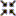
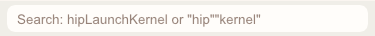
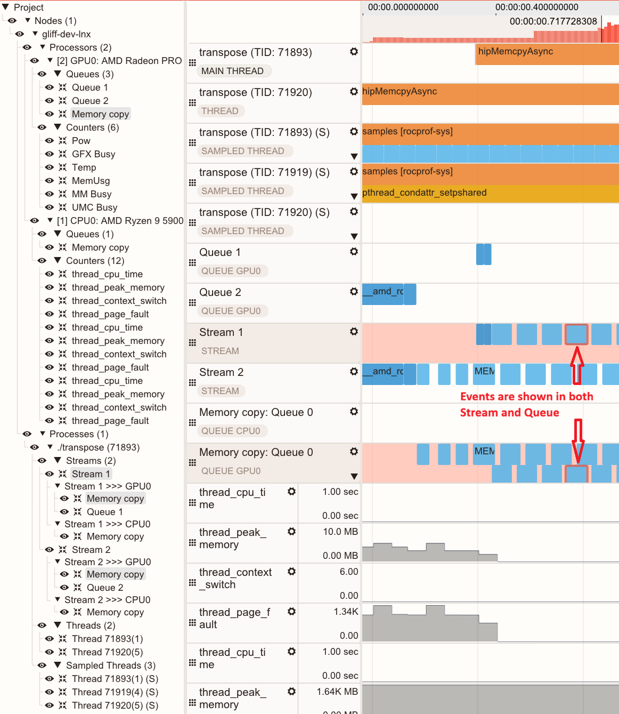
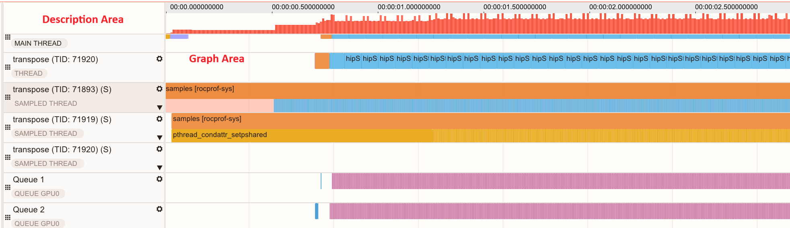
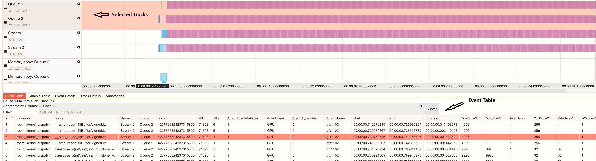
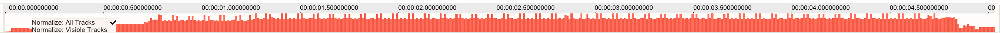

.. meta::
  :description: Learn how to view your trace data in ROCm Optiq
  :keywords: Optiq, ROCm, trace, data, events, tracks, timeline

******************************
View trace data in ROCm™ Optiq
******************************

.. |eye| image:: ../images/eye.png

ROCm™ Optiq allows you to inspect CPU-GPU interactions, ROCm API calls, kernel execution timelines, memory usage, and system telemetry data for applications running on the ROCm stack.

The application provides a detailed view of a *trace*: a complete record of profiling data captured during an application run, including all event tracks, sample counters, and metadata. It captures what happened, when it happened, and often how long it took.

Traces are comprised of event tracks and counter tracks:

- An event track is a horizontal lane in the profiler's timeline view that displays individual events such as API calls (e.g., ROCm functions), Kernel dispatches on the GPU, CPU function calls or other execution units. Each event is shown as a bar positioned according to its start and end timestamps, allowing you to visualize execution order and duration.
- A counter track is a timeline track that displays hardware metrics collected during the application execution. These counters (or telemetry) come from the GPU, CPU, NIC (for host or device, these can also include network traffic) and represent low-level events or states, such as:

  - Clock frequency (GPU/CPU operating speed)
  - Power consumption
  - Thermal readings
  - Instruction counts (e.g., `Vector arithmetic logic unit <https://rocm.docs.amd.com/projects/rocprofiler-compute/en/latest/conceptual/pipeline-descriptions.html#desc-valu>`_ / `Scalar arithmetic logic unit <https://rocm.docs.amd.com/projects/rocprofiler-compute/en/latest/conceptual/pipeline-descriptions.html#desc-salu>`_)
  - Memory bandwidth and cache hits/misses

Open a trace file
=================

The tool supports the ROCm database formats (``.db`` and ``.rpd``).

- ``.db`` files are trace files in the `ROCm Profile Data (ROCpd) <https://github.com/ROCm/rocmprofiledata>`_ format generated by the `ROCprofiler-SDK (rocprofv3) <https://rocm.docs.amd.com/projects/rocprofiler-sdk/en/latest/how-to/using-rocpd-output-format.html>`_ and `ROCm Systems Profiler <https://rocm.docs.amd.com/projects/rocprofiler-systems/en/latest/what-is-rocprof-sys.html>`_.
- ``.rpd`` files are trace files in the ROCpd format generated by tools such as `RPD tracer <https://github.com/ROCm/rocmProfileData/tree/master/rpd_tracer>`_. Although this is a legacy file format, the tools and the format still receive updates.

Open a trace by going to **File** > **Open**. You can also open files by dragging and dropping them onto the application window.

.. note:: 

  If the trace file isn't opening, the file may be in an unsupported format. Convert the file to a supported format (``.db`` or ``.rpd``) using ROCm scripts.

View trace data
===============

Once you open a trace file, you can view its data from the :ref:`topology` and the :ref:`timeline`.

Search for events
-----------------

Search for events using the search box on the main **Toolbar**.

- To search, type in your search string and press **Enter** (search is case-insensitive).
- Clicking on a row in the search results will bring the selected event into view on the :ref:`timeline`.
- Clicking **X** clears the search results.
- The search can match multiple substrings at once. Multiple search tokens must be surrounded by quotation marks without spaces (for example: ``“term1””term2”``).

.. _topology:

System Topology View
--------------------

The **System Topology View** displays a hierarchical representation of the hardware or system components such as nodes, processes and the GPU queues, memory operations, threads, and more that belong to them.

- Click the eye |eye| icon to show or hide tracks. 
- Click the scroll |scroll| button to go to the track in the :ref:`timeline`. 

.. _timeline:

Timeline View
-------------

The **Timeline View** displays CPU and GPU activities, events, and performance metrics chronologically. You can:

- See events such as API calls, kernel dispatches, and more.
- See performance counter data as charts displaying the data points.
- Zoom, filter, and bookmark data for detailed analysis. This is useful for correlating GPU workloads with in-application CPU events and performance with hardware resource usage, allowing for performance blockers to be easily identified and remedied.

The **Timeline View** has a **Description** area that describes a specific category of events or metrics within a profiling trace, and a **Graph** area where events and counter graphs are plotted:

Use the Timeline View
~~~~~~~~~~~~~~~~~~~~~

Navigate the Timeline
^^^^^^^^^^^^^^^^^^^^^

You can pan and scroll through the **Timeline View** using the scrollbars or by dragging your mouse across the **Graph** area of the **Timeline View**.

The **WASD** and arrow keys can be also used to zoom and pan the view:

- **W** / **S**: Zoom in and out, respectively.
- **A** or **Left Arrow** / **D** or **Right Arrow**: Pan left and right, respectively.
- **Up Arrow** / **Down Arrow**: Scroll the track list up and down.

When hovering over the **Description** area, the scroll wheel will scroll through the track list. When hovering over the **Graph** area, the scroll when zooms the view in and out.

Select a track
^^^^^^^^^^^^^^

Clicking in the **Description** area selects or deselects the track. 
When a track is selected, the details display in the **Track Details** pane.

Additionally, depending on the track type, the **Event Table** or **Sample Table** tabs in the **Advanced Details** section will be populated by the contents of the track.

Select an event
^^^^^^^^^^^^^^^

Clicking on an event in the **Graph** area selects or deselects an event. 
When selected, details for the event can be seen in the **Event Details** tab of the **Advanced Details** section.

.. tip:

   When you hover over a region with high-density events, the application displays the total number of events in each category.

Resize or reorder tracks
^^^^^^^^^^^^^^^^^^^^^^^^

- Resize tracks by hovering over and dragging the separator lines between tracks.
- Reorder tracks by clicking and dragging the grip button |grip| on the left side of the **Description** area.

Histogram
~~~~~~~~~

The **Histogram** shows an event-density visual representation of all visible tracks.

When the **Timeline View** is zoomed in, the area currently in view is highlighted on the **Histogram**. 
The highlighted area in the **Histogram** can be dragged to scroll the **Timeline View**.

.. _advanced:

Advanced Details
~~~~~~~~~~~~~~~~

The **Advanced Details** section provides an in-depth view of profiling data, enabling you to analyze performance metrics and event-specific information. 
This section provides an interface for multiple data perspectives, offering granular insights through these components:

- **Event Table**: Displays all events within the selected tracks. You can refine your analysis by applying a time-range selection or executing customized SQL-like queries, ensuring targeted event exploration.

  .. image:: ../images/advanced.png
    :width: 800
    :align: center

  - **Group By**: This drop-down groups the results by the selected column and displays the default aggregations shown in the **Group Columns** box.
  - **Group Columns**: Enter custom SQL aggregation statements.
  - **Filter**: Enter SQL-like statements to filter the data. For example, ``“min_duration > 2000”`` will filter all events shorter than 2000 ns.
  
  .. tip::

     - Right-click on the column headers to show/hide columns.
     - Right-click on a table row and select **Go to event** to navigate to the **Timeline View** to the highlighted event.
     - :ref:`time-range-filter` using the **Timeline View** to filter the rows to data contained within the selected time range.

- **Sample Table**: Presents all performance counter data points associated with the selected tracks. Similar to the Event Table, it supports time-range selection and SQL-like query capabilities for detailed performance analysis.
- **Event Details**: Shows extended information about the event that is not shown in the timeline or the event table. It shows raw database such as timestamps, duration, associated queue/stream, correlation IDs and API method parameters. It also shows Flow and Call stack information, if available.
- **Track Details**: Shows additional information about the track that is not visible on the timeline. It shows the node the track belongs to and its details, the process it belongs to, the type of track (Thread, Counter, Queue, etc.).
- **Annotations**: Displays user-created annotations, allowing for easier navigating across critical points within large traces, enhancing collaboration and sharing knowledge. See :ref:`annotation` for more info.

Save a project file
===================

Customizations made to tracks, bookmarks, and annotations can be persisted by saving the session as a project (``.rpv`` file). 
See :ref:`customize` for more information on these features.

- Go to **File** > **Save** As to create a new project.
- Go to **File** > **Save** to overwrite the currently opened project.

