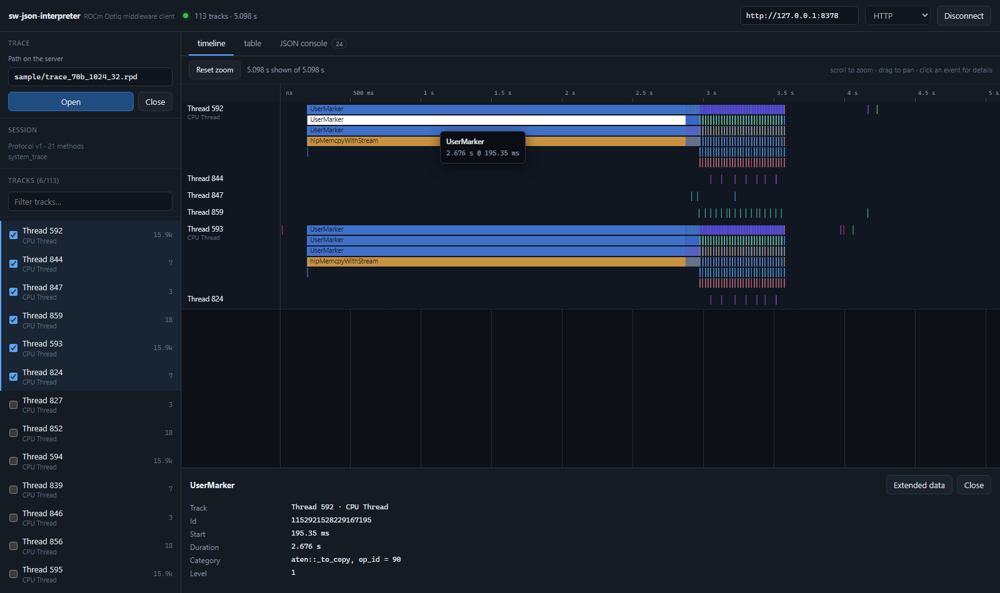

# sw-json-interpreter

A React proof of concept that drives a system trace through the
[ROCm Optiq middleware](../src/middleware/README.md), to show that the JSON
boundary is enough to build a frontend on without linking any C++.

It does the basics of what the desktop app does -- open a trace, browse the
timeline, inspect an event, page through a table -- and nothing more. The
point is the boundary, not feature parity.



## What it does

| | |
| --- | --- |
| **Timeline** | Tracks drawn on a canvas, with zoom, pan, hover, and click-to-inspect. Nested events stack by level; counter tracks draw as an area chart |
| **Details** | The selected event's fields, and its extended properties on demand |
| **Table** | A page of any track-scoped table, with the schema taken from the response |
| **JSON console** | Every request and response the UI makes, plus a box to hand-write one |

The console is the part worth looking at first. Everything the UI does is one
of those documents, so the whole surface is legible from inside the app.

## What it leaves out

Compare, search, flow arrows, callstacks, summary trees, histograms, trimming,
CSV export, compute traces, the profiler launcher, and remote sessions. The
middleware exposes some of these; this client just does not draw them.

## Running it

Start a middleware server from the repo root, so trace paths resolve the way
you expect:

```bash
roc-optiq-middleware-http --port 8378
```

Then:

```bash
npm install
npm run dev
```

Connect, give it a path **the server** can reach (`sample/trace_70b_1024_32.rpd`
works), and press Open. HTTP is the default; the same session is reachable over
the WebSocket, which the transport dropdown switches to.

The path box starts on that sample. To point it somewhere else by default, put
the path in `.env.local`, which is not committed:

```
VITE_TRACE_PATH=C:\path\to\your.db
```

## How it talks to the server

`src/api/client.ts` is the whole client, and the two transports differ only in
plumbing -- the same document goes in and comes back either way. HTTP posts to
`/rpc`; the WebSocket keeps one connection up and correlates replies by the
`id` the server echoes.

Fetching methods answer with an envelope rather than the payload, so
`fetchAsync` polls `request.poll` until the request reaches a terminal state,
reporting progress as it goes. It polls rather than passing `wait_ms` on
purpose: the server serialises requests, so a long inline wait would stall
every other client.

The timeline reads `graph.fetch` rather than `track.fetch`, asking for entries
at roughly the plot's pixel resolution. On a busy track that is the difference
between 19k entries in about 2 seconds and 1.5M in about 72; the entries carry
real ids either way, so an event can still be inspected after being drawn from
a level-of-detail response.

Two details that are easy to get wrong, both handled in `src/api/types.ts`:

- **Ids past 2^53** arrive as decimal strings and have to be echoed back
  exactly as they came. Rounding one through a JavaScript number lands on a
  neighbouring event rather than on nothing, which is silently wrong data, so
  ids are carried as `number | string` and never reformatted.
- **Track naming varies by trace.** RPD system traces leave `main_name` empty
  and put `Thread 592` in `sub_name` with `CPU Thread` as the category, so
  labels fall back through all three rather than showing a bare id.

## Checking it against a real server

`scripts/smoke.mjs` makes the same calls the UI does, with the same parameter
names, and checks the shapes that come back:

```bash
node scripts/smoke.mjs http://127.0.0.1:8378
```

It needs a server with `sample/trace_70b_1024_32.rpd` reachable, and it opens
and closes a trace as it goes. Set `TRACE_PATH` to point it somewhere else.
